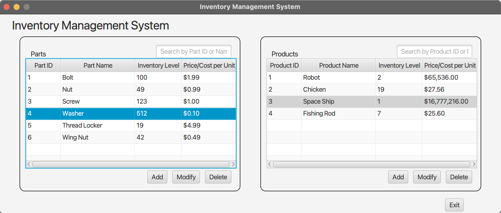
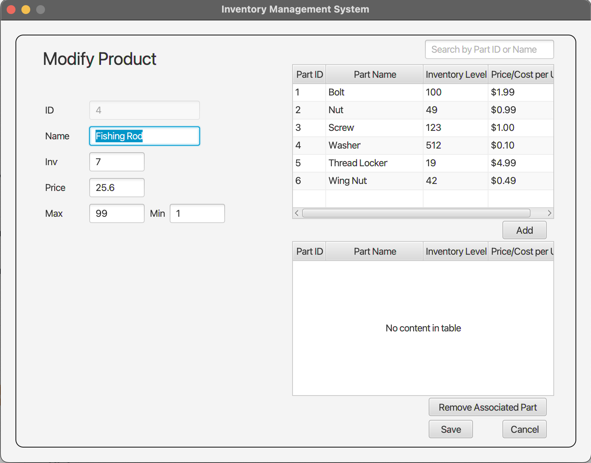

# Intro To Java project
#
This was my final project for my Software I course. For this particular course I used IntelliJ IDEA, Java 17, and Scene Builder for visual layout of the JavaFX components. The competencies were as follows:

- The graduate designs software solutions with appropriate classes, objects, methods, and interfaces to achieve specific goals.
- The graduate implements object-oriented design principles (e.g., inheritance, encapsulation, and abstraction) in developing applications for ensuring the application’s scalability.
- The graduate produces applications using high-level programming language constructs to meet business requirements.
- The graduate incorporates simple exception handling in application development for improving user experience and application stability.
- The graduate develops user interfaces to meet project requirements.

#

The application is built using a Model-View-Controller design pattern. The Model defines the data in use by this interface, the View defines the GUI/visual aspect, and the Controller defines the GUIS behavior.

Below is a screenshot of the main application screen, and another of the 'Modify Product' screen.
#

